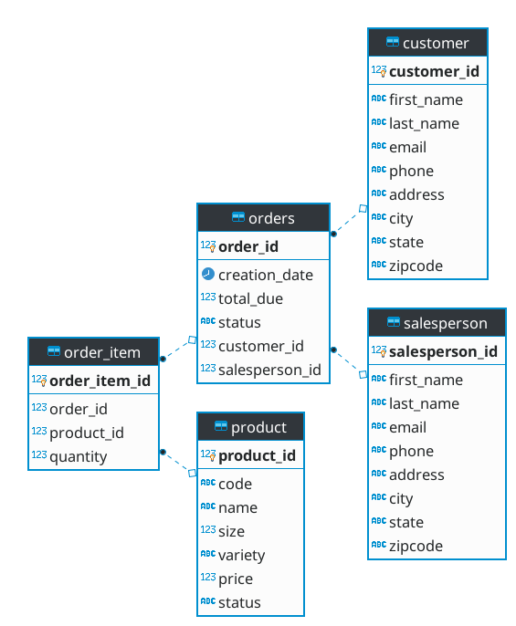

# Introduction
This application demonstrates how do developers deal with PostgreSQL CRUD (Create, Read, Update, Delete) 
operations at a high abstraction level using the DAO (Data Access Object) pattern. 
By implementing this project, I got familiar with the basic usage of JDBC (Java Database Connectivity). 
More importantly, I learnt several essential concepts for developing applications that interact with DBMS, 
including the repository pattern, DAO, database transaction, etc.

# ER Diagram

# Design Patterns
Discuss DAO and Repository design patterns (150-200 words)
