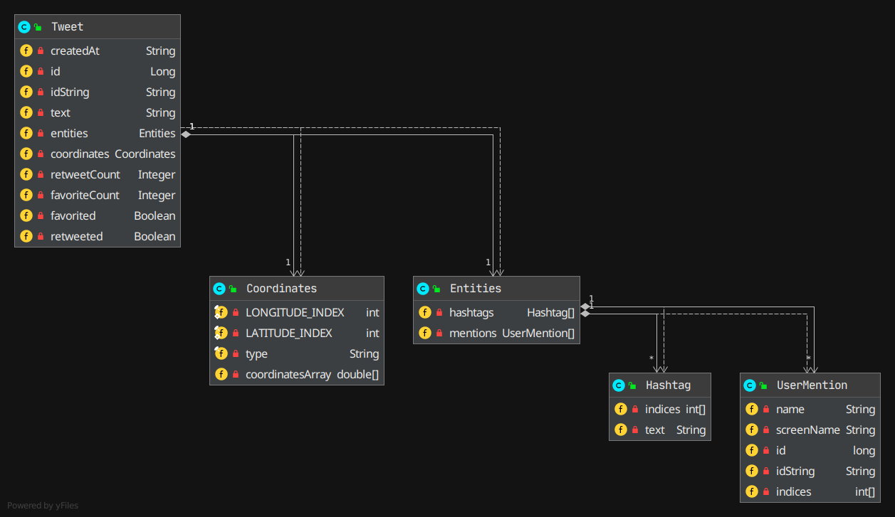

# Introduction
TwitterCLIApp is a simple Twitter client that allows users to post, show and delete tweets via command-line interface (CLI).
The architecture of this application follows the M~~V~~C (Model, ~~Viewer~~, Controller) pattern.
The classes except models and utilities are covered by unit & integration tests.
By implementing this project, I have been familiar with many key concepts in web development
such as HTTP, JSON, MVC, and Spring framework. I also get valuable hands-on experience in testing and refactoring code,
which will help me to develop larger applications in the future.

## Quick Start

### Requirements

- **JDK: >= 8**

- **Maven: >= 3.6.0** 

### Build
```
mvn clean package -DskipTests
```
### Run
```
java -jar target/java_apps-1.0-SNAPSHOT.jar [post | show | delete] [options]
```

### Usage

#### Create 
Create a tweet with a geotag and print the created tweet object (simplified version) in JSON format.
```
USAGE:
TwitterCLI "post" "tweet_text" "latitude:longitude"


Arguments:
tweet_text         - tweet_text cannot exceed 140 UTF-8 encoded characters
latitude:longitude - Geo location

e.g.
TwitterCLI post "test post" "0:0"
```

#### Show
Lookup a tweet by ID and print the tweet object in JSON format. Optionally you can specify a subset of fields
to show. Available fields: `created_at`, `id`, `id_str`, `text`, `entities`, `coordiantes`, `retweet_count`,
`favorite_count`, `favorited`, `retweeted`. 

```
USAGE:
TwitterCLI show tweet_id [field1,fields2,...]

Arguments:
tweet_id              - Tweet ID. Same as id_str in the tweet object
[field1,fields2,...]  - A comma-separated list of top-level fields from the tweet object

e.g. 
TwitterCLI show 1097607853932564480 "id,text,retweet_count"
TwitterCLI show 1097607853932564480 ## show all fields
```

#### Delete

Delete a list of tweets by id and print deleted tweet object.
```
USAGE: TwitterCLI delete [id1,id2,..]

Arguments:
tweet_ids - A comma-separated list of tweet ids, at least 1 should be given

e.g.
TwitterCLI delete 1200145224103841792
```

# Design


## Components


1. [**HttpHelper**](./src/main/java/ca/jrvs/apps/twitter/dao/helper):
Given a Uniform Resource Identifier (URI) and a method (either GET or POST),
the helper constructs, signs, and executes the corresponding HTTP request. 

2. [**Data Access Object (DAO)**](./src/main/java/ca/jrvs/apps/twitter/dao): 
The DAO component handles data with external storage, which is [Twitter REST API](https://developer.twitter.com/en/docs) 
in this application. It constructs URIs and sends the requests to the server with the help of `HttpHelper`,
then processes the HTTP response received. 

3. [**Service**](./src/main/java/ca/jrvs/apps/twitter/service): 
The service component handles the business logic of the application. In particular, it is responsible to check
if the input is valid, e.g., the status didn't exceed the maximum length allowed, the coordinates are within the range, etc. 

4. [**Controller**](./src/main/java/ca/jrvs/apps/twitter/controller):
The controller consumes user input `args[]` and calls the corresponding service layer method 
without doing anything related to business logic. 

5. [**Application**](./src/main/java/ca/jrvs/apps/twitter/TwitterCLIApp.java): 
On top of all layers, the application instantiates other components and trigger `run` method
which calls controller methods and print the response to command line.

## Model
Models are implemented with plain old Java object (POJO) which is a class with private member variables and public getter and setters. This class encapsulates Tweet data (Tweet objects) which often display in JSON format. 
The full version of the [Tweet object](https://developer.twitter.com/en/docs/tweets/data-dictionary/overview/tweet-object)
is complicated, hence we designed a simplified one: 


### Example Tweet JSON 

```json
{
   "created_at":"Mon Feb 18 21:24:39 +0000 2019",
   "id":1097607853932564480,
   "id_str":"1097607853932564480",
   "text":"test with loc223",
   "entities":{
      "hashtags":[],      
      "user_mentions":[]  
   },
   "coordinates":null,    
   "retweet_count":0,
   "favorite_count":0,
   "favorited":false,
   "retweeted":false
}
```

# Improvements
- Develop more functionalities such as user-timeline lookup. 

- Let the app work interactively.

- Make a GUI.

- Extend the current Tweet model so users can get more from Twitter via this client app. 
