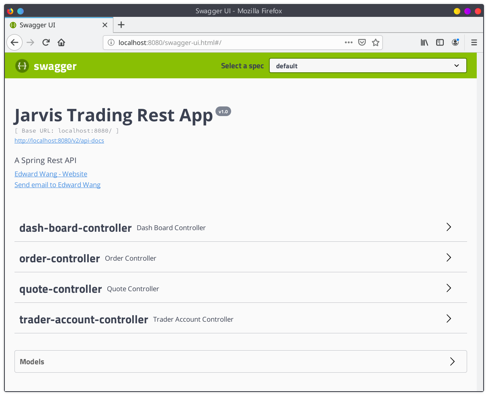

# Table of contents
* [Introduction](#Introduction)
* [Quick Start](#Quick-Start)
* [Architecture](#Architecture)
* [REST API Usage](#REST-API-Usage)
* [Docker Deployment](#Docker-Deplotment)
* [Improvements](#Improvements)

# Introduction
Jarvis Trading platform is an online stock trading simulation system that allows users (e.g. front-end developers, mobile developers, and traders) to access and play with real-time market data via REST API. The system is designed with microservice architecture, implemented with Java 8 and SpringBoot. [IEX Cloud](https://iexcloud.io/) is used as the data source, and the backend utilizes PostgreSQL database and JPA/Hibernate to persist market/user/transaction data.

# Quick Start
- **Prequiresites:**
	- Docker
	- An IEX Cloud account (free tier available)
- **Get started:**
	1. Make sure Docker daemon is running.
	2. Build the database image `trading-psql` and the application image `trading-app`:
		``` sh
		cd ./psql
		docker build -t trading-psql .
		docker image ls -f reference=trading-psql

		cd ..
		docker build -t trading-app .
		docker image ls -f reference=trading-app
		```
	3. Create the docker network `trading-network`:
		``` sh
		docker network create trading-network
		docker network ls
		```
  	4. Start the containers, your IEX credential is needed here: 
		```sh
		docker run --name trading-psql-dev \
		-e POSTGRES_PASSWORD=password \
		-e POSTGRES_DB=jrvstrading \
		-e POSTGRES_USER=postgres \
		--network trading-net \
		-d -p 5432:5432 trading-psql

		IEX_PUB_TOKEN="your_token"

		docker run --name trading-app-dev \
		-e "PSQL_URL=jdbc:postgresql://trading-psql-dev:5432/jrvstrading" \
		-e "PSQL_USER=postgres" \
		-e "PSQL_PASSWORD=password" \
		-e "IEX_PUB_TOKEN=${IEX_PUB_TOKEN}" \
		--network trading-net \
		-p 5000:5000 -t trading-app

		# you should see two running docker containers
		docker container ls
		```
- Try the trading-app with SwaggerUI, you can access it from [here](http://localhost:8080/swagger-ui.html#/)
after successfully starting the application.




# Architecture
- Draw a component diagram which contains controllers, services, DAOs, psql, IEX Cloud, WebServlet/Tomcat, HTTP client, and SpringBoot. 
- briefly explain the following components and services (3-5 sentences for each)
  - Controller layer (e.g. handles user requests....)
  - Service layer
  - DAO layer
  - SpringBoot: webservlet/TomCat and IoC
  - PSQL and IEX

# REST API Usage
## Swagger
What's swagger (1-2 sentences, you can copy from swagger docs). Why are we using it or who will benefit from it?
## Quote Controller
- High-level description for this controller. Where is market data coming from (IEX) and how did you cache the quote data (PSQL). Briefly talk about data from within your app
- briefly explain each endpoint
  e.g.
  - GET `/quote/dailyList`: list all securities that are available to trading in this trading system blah..blah..
## Trader Controller
- High-level description for trader controller (e.g. it can manage trader and account information. it can deposit and withdraw fund from a given account)
- briefly explain each endpoint
##Order Controller
- High-level description for this controller.
- briefly explain each endpoint
## App controller
- briefly explain each endpoint
## Optional(Dashboard controller)
- High-level description for this controller.
- briefly explain each endpoint

# Docker Deployment
- docker diagram including images, containers, network, and docker hub
e.g. https://www.notion.so/jarviscanada/Dockerize-Trading-App-fc8c8f4167ad46089099fd0d31e3855d#6f8912f9438e4e61b91fe57f8ef896e0
- describe each image in details (e.g. how psql initialize tables)

# Improvements
If you have more time, what would you improve?
- at least 5 improvements
