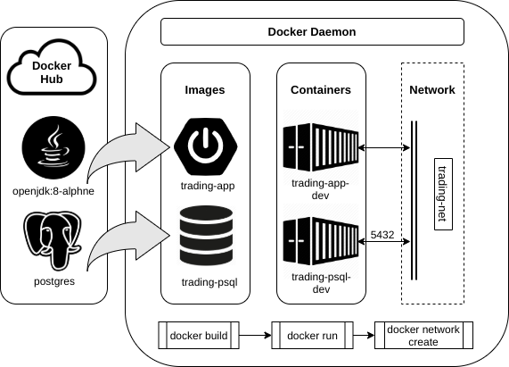

# Table of contents
* [Introduction](#Introduction)
* [Quick Start](#Quick-Start)
* [Architecture](#Architecture)
* [REST API Usage](#REST-API-Usage)
* [Docker Deployment](#Docker-Deplotment)
* [Improvements](#Improvements)

# Introduction
Jarvis Trading platform is an online stock trading simulation system that allows users (e.g. front-end developers, mobile developers, and traders) to access and play with real-time market data via REST API or Swagger UI. The system is designed with microservice architecture, implemented with Java 8 and SpringBoot. [IEX Cloud](https://iexcloud.io/) is used as the data source, and the backend utilizes PostgreSQL database and JPA/Hibernate to persist market/user/transaction data.

# Quick Start
- **Prequiresites:**
	- Docker
	- An IEX Cloud account (free tier available)
- **Get started:**
	1. Make sure Docker daemon is running.
	2. Build the database image `trading-psql` and the application image `trading-app`:
		``` sh
		cd ./psql
		docker build -t trading-psql .
		docker image ls -f reference=trading-psql

		cd ..
		docker build -t trading-app .
		docker image ls -f reference=trading-app
		```
	3. Create the docker network `trading-network`:
		``` sh
		docker network create trading-network
		docker network ls
		```
  	4. Start the containers, your IEX credential is needed here: 
		```sh
		docker run --name trading-psql-dev \
		-e POSTGRES_PASSWORD=password \
		-e POSTGRES_DB=jrvstrading \
		-e POSTGRES_USER=postgres \
		--network trading-net \
		-d -p 5432:5432 trading-psql

		IEX_PUB_TOKEN="your_token"

		docker run --name trading-app-dev \
		-e "PSQL_URL=jdbc:postgresql://trading-psql-dev:5432/jrvstrading" \
		-e "PSQL_USER=postgres" \
		-e "PSQL_PASSWORD=password" \
		-e "IEX_PUB_TOKEN=${IEX_PUB_TOKEN}" \
		--network trading-net \
		-p 5000:5000 -t trading-app

		# you should see two running docker containers
		docker container ls
		```
- Try the trading-app with SwaggerUI, you can access it from [here](http://localhost:8080/swagger-ui.html#/)
after successfully starting the application.


# Architecture


## Controller layer
The controller layer defines the endpoints that users can exploit. It handles HTTP requests and sends the data to the corresponding service for further processing.

## Service layer
The service layer handles business logic to operate on the data sent to and from the data access layer and the controllers.

## Data access layer
The data access layer is responsible for retrieving and persisting data from external database sources. In this project, JPA/Hibernate is utilized to manage the relational data. 

## Spring/SpringBoot
The trading system is a Spring Boot application. The Spring framework utilized Inversion of Control (IoC) to manage the components that make up the whole application. In addition to Spring, Spring Boot makes the configuration of the application a lot easier and provides the embedded HTTP server (Apache Tomcat).

## External data
Real-time market data is retrieved from IEX Cloud and persisted into a PSQL database.  The database also stores the user and transaction information.

# REST API Usage
## Swagger
Swagger UI allows users to visualize and interact with the API’s resources without having any of the implementation logic in place.

## Quote Controller
Quote Controller allows you to show/modify/update the system's daily list. It will consume the data from IEX Cloud to make sure the local Quote table is valid and up-to-date. 
- GET `/quote/dailyList`: list all securities that are available to trading in this trading system
- GET `/quote/dailyList`: list all quotes currently saved in the Quote table
- PUT `/quote/tickerId/{tickerId}`: add a quote to the Quote table
- PUT `/quote/update`: update a particular quote
- PUT `/quote/updateAll`: update all quotes in the quote table

## Account Controller
Account controller lets users manage trader and account information and deposit and withdraw funds to/from a given account.
- POST `/trader/firstname/{firstname}/lastname/{lastname}/dob/{dob}/country/{country}/email/{email}`:
create a new trader and an account with input personal information
- POST `/trader`: create a trader and an account with a JSON object
- POST `/trader/traderId/{traderId}`: add an account for the an existing trader
- DELETE `/trader/traderId/{traderId}`: delete a trader and its associated accounts
- PUT `/trader/deposit/accountId/{accountId}/ammount/{amount}`: deposit funds into an account
- PUT `/trader/withdraw/accountId/{accountId}/amount/{amount}`: withdraw funds from an account

## Order Controller
Order controller handles market order specified by users.
- POST `/order/marketOrder`: put a market order for an account; can be either a buy or sell order

## Dashboard controller
Dashboard controller provides a place that you can easily view account-related information.
- GET `/dashboard/profile/accountId/{accountId}`: show account profile by given account ID
- GET `/dashboard/profile/traderId/{traderId}`: show trader profile by given trader ID
- GET `/dashboard/portfolio/accountId/{accountId}`: show account portfolio by given account ID

# Docker Deployment


- `trading-psql` is an image built on top of the official Postgres docker image `postgres:9.6-alpine`. In addition to the official image, `trading-psql` has all necessary databases and tables initialized.
- `trading-app` is based on the `openjdk:8-alpine` and `maven:3.6-jdk-8-slim` official images. The container will first compile and package the source code using maven, then start the applicaiton.
- `trading-net` is a docker network which allows docker containers to communicate with each other. In this case, `trading-app` needs to communicate with `trading-psql` which listens on port `5432`.

# Improvements
A few things that I could improve:

- Record each transaction.
- Develop a serious IAM (Identity and access management) system.
- Develop a more accessible front end.
- Improve the stability and robustness of the application.
- Deploy the application to a cloud platform, e.g., AWS, GCP, Azure.
